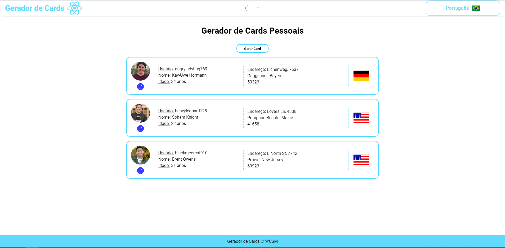
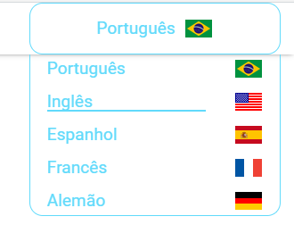
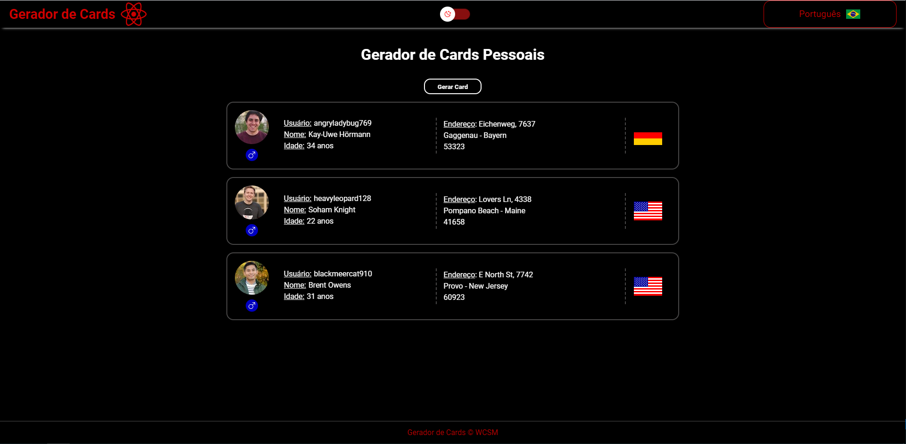

<h1 align="center">
  
Person Cards

  
</h1>

  
  
  
  
  
  
  
  

## 💻 Introdução

Person Cards é uma aplicação com foco na prática em React, com temas claro e escuro, multi-idiomas (5 idiomas) e consumo de API.

Acesse a aplicação online [clicando aqui](https://wallacemartinsti.github.io/person-cards/).

## 🔨 Funcionamento

- Gere Cards Pessoais;

- Altere entre os temas claro e escuro;

- Escolha o idioma desejado dentro as cinco opções;

## 📷 Screenshots

   

      <h2>Opções de Idiomas</h2>
      
   

   

      <h2>Tema Light</h2>
      
   

   

      <h2>Tema Dark</h2>
      
   

## 💿 Instalação

Após baixar o projeto, acesse seu diretório e utilize o comando:

<code>npm install</code>

para instalar as dependencias necessárias e depois,
para rodar em modo desenvolvimento, utilize:

<code>npm run dev</code>

## ✔️ Tecnologias utilizada

- `ReactJS`
- `Vite`
- `Typescript`
- `i18next`
- `Sass`

## 📄 Licença

Esse projeto está sob a licença MIT. Veja o arquivo [LICENSE](./license) para mais detalhes.
